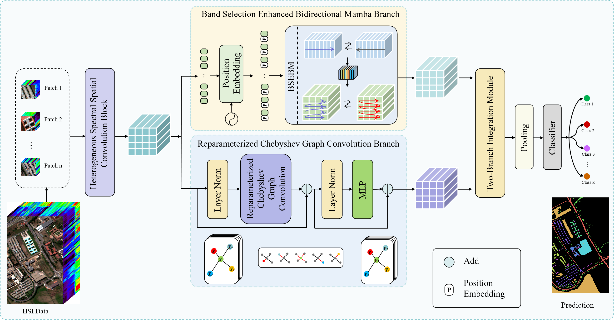

# 📖 DBMGNet: A Dual-Branch Mamba-GCN Network for Hyperspectral Image Classification (IEEE TGRS 2025)

PyTorch codes for "[DBMGNet: A Dual-Branch Mamba-GCN Network for Hyperspectral Image Classification](https://ieeexplore.ieee.org/document/10976709)", **IEEE Transactions on Geoscience and Remote Sensing**, 2025.

- Authors: Hao Wang, Peixian Zhuang, Xiaochen Zhang, and Jiangyun Li

### Overall
<div align=center>

</div>

### 🌱Abstract
>In hyperspectral image (HSI) classification, convolutional neural networks (CNNs) excel at local feature modeling but are limited to Euclidean space. Transformers offer long-range dependency modeling but suffer from high computational complexity. In contrast, graph convolutional networks (GCNs) can process information in non-Euclidean space, compensating for the limitations of CNNs. Meanwhile, the state space model Mamba, thanks to its linear complexity and strong long-range dependency modeling, shows great potential to offer an alternative to Transformers for HSI classification. To address the limitations of CNNs and Transformers while exploiting the potential of Mamba, we propose a dual-branch hybrid architecture named DBMGNet that combines Mamba with GCN for the HSI classification. In the Mamba branch, we design Band Selection Enhanced Bidirectional Mamba (BSEBM), which leverages Mamba’s long-range dependency modeling and sequential modeling capabilities to process spatial-spectral information. In the GCN branch, we apply reparameterized Chebyshev graph convolution to model similarity dependencies in non-Euclidean space, along with designing an adjacency matrix based on the intrinsic characteristics of HSIs. Extensive experiments demonstrate that our DBMGNet achieves the state-of-the-art performance of HSI classification against thirteen mainstream approaches.

### 📃 Requirements
>* Python == 3.8.19
>* pytorch == 2.4.0
>* causal-conv1d == 1.4.0
>* mamba_ssm==2.2.2

### 🥰 Citation	

**Please kindly cite the papers if this code is useful and helpful for your research.**
```
@ARTICLE{10976709,
  author={Wang, Hao and Zhuang, Peixian and Zhang, Xiaochen and Li, Jiangyun},
  journal={IEEE Transactions on Geoscience and Remote Sensing}, 
  title={DBMGNet: A Dual-Branch Mamba-GCN Network for Hyperspectral Image Classification}, 
  year={2025},
  volume={63},
  number={},
  pages={1-17},
  keywords={Feature extraction;Transformers;Computational modeling;Convolution;Hyperspectral imaging;Computer architecture;Data models;Computational complexity;Data mining;Image classification;Dual-branch;graph convolutional network (GCN);hyperspectral image (HSI) classification;Mamba},
  doi={10.1109/TGRS.2025.3564364}}
```


